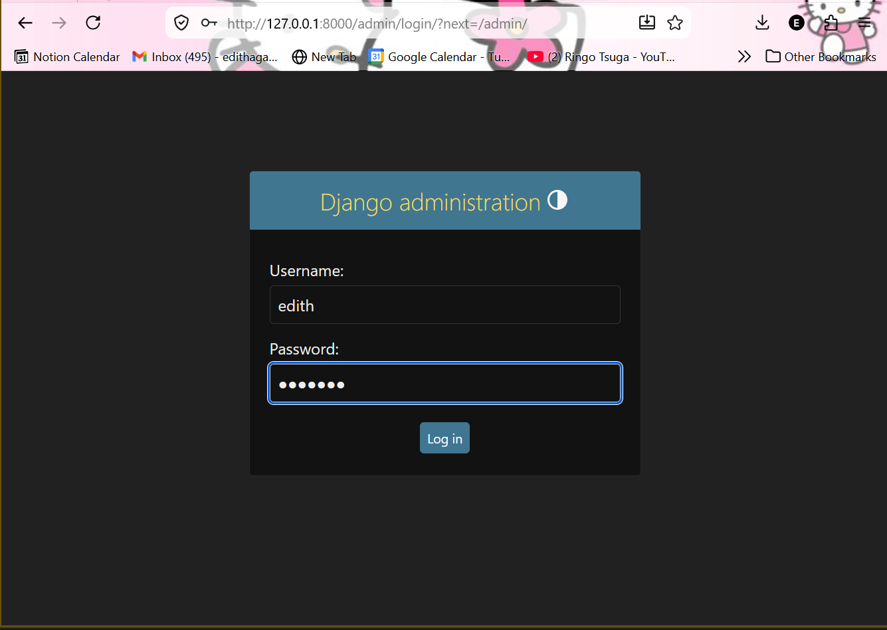
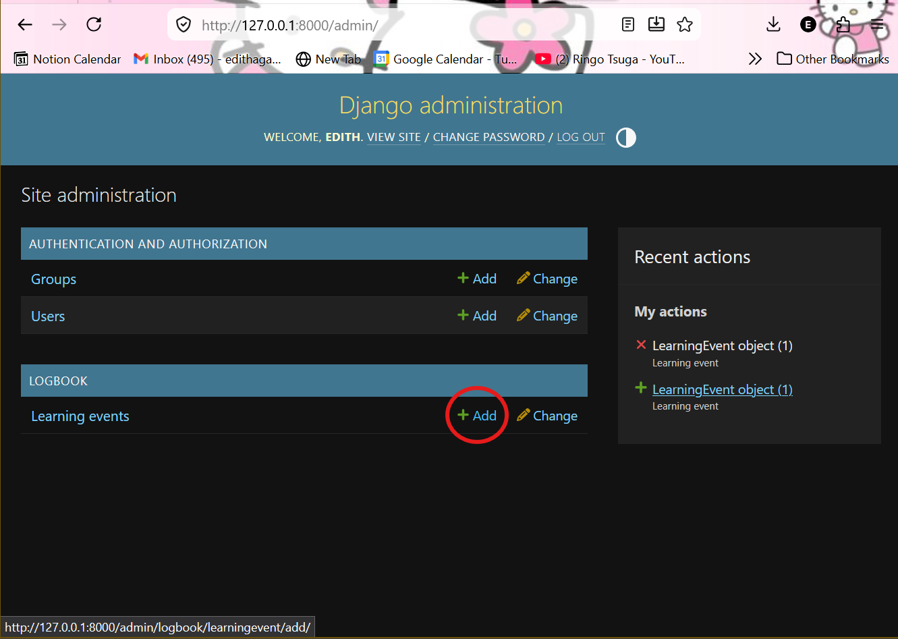
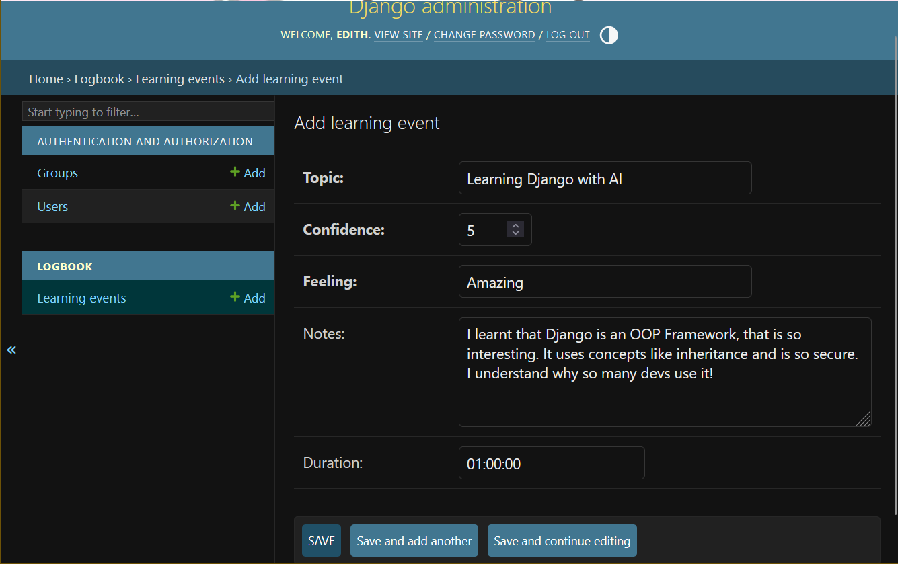
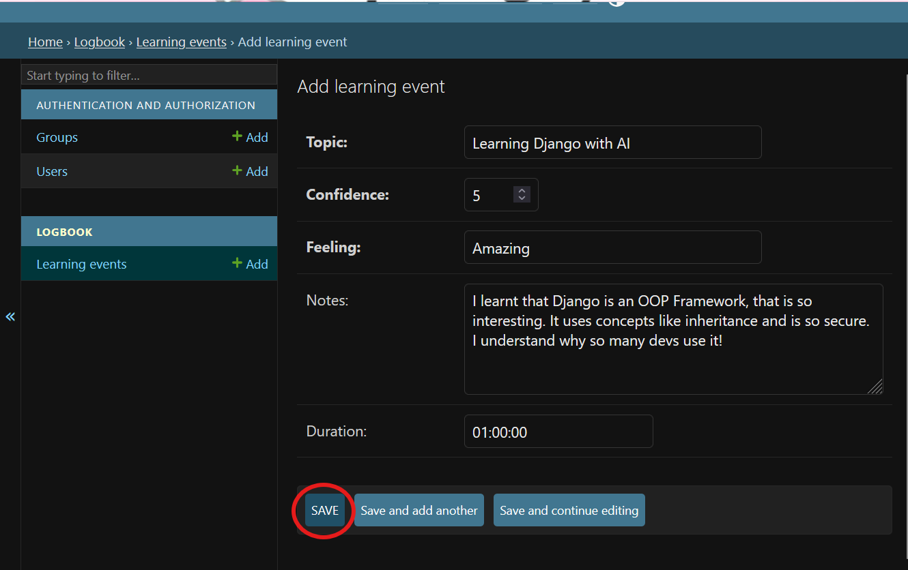
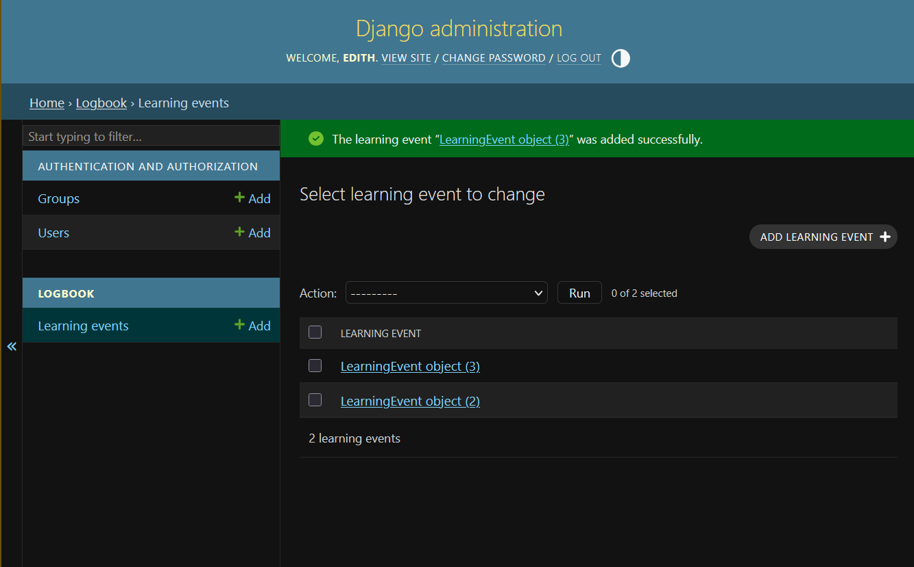

# 🧠 Moringa AI Capstone Project: Beginner’s Toolkit with GenAI
## Getting Started with Django – A Beginner’s Guide
### Introduction: What is Django and why did I chose it?
- Django is a free and open source framework made from python that encourages  - rapid development, clean and pragmatic design.
- Django follows a batteries included type of philospophy where it provides and ORM, Authentication, admin panel making it the best for complex and data driven web applications.
- Django is also very fast, secure and scallable making it a fan favourite for the back-end.
- Django has been used in apps like Pinterest, Dropbox, Spotify, Mozilla and even big corporations like NASA have used it

---

## System requirements 

- **Python**: 3.8 or higher
- **OS**: Linux, macOS, or Windows
- **Package Manager**: pip (comes with Python)
- **Git**: For version control
- **Text Editor/IDE**: VS Code (or any preferred editor)

---

## Installation & Setup Instructions

### Step 1: Clone the repository
```bash
git clone https://github.com/ethereal-edith/neurotrack.git
cd neurotrack
```

### Step 2: Create a virtual environment
for linux/wsl
```bash
python3 -m venv neurotrack-env
source neurotrack-env/bin/activate  
```
or windows
```bash 
python3 -m venv neurotrack-env
source neurotrack-env\Scripts\activate
```

### Step 3: Install dependencies
```bash
pip install -r requirements.txt
```

### Step 4: Run migrations
```bash
python manage.py migrate
```

### Step 5: Create a superuser (admin account)
```bash
python manage.py createsuperuser
```

### Step 6: Start development server
```bash
python manage.py runserver
```

### Step 7: Access the application
- Admin Panel: http://127.0.0.1:8000/admin

---


## Working Example

**What Neuro-track does:**
Neuro-track is a learning logbook that reflects on three aspects of each learning session:
1. **What did I learn?** — Record the topic (e.g., "Django Models")
2. **How confident am I?** — Rate 1-10
3. **How did it feel?** — Emotional state ("Aha! Moment", "Frustrated", "Brain Fog", etc.)

**How to use it:**
<b>
1. Go to http://127.0.0.1:8000/admin and log in
<div>

</div>
2. Click "Learning events" → "Add Learning event"
<div>

</div>
3. Fill in: Topic, Confidence, Feeling, Notes (optional), duration (optional)
<div>

</div>
4. Click Save
<div>

</div>
5. Entry appears in logbook with automatic timestamp
<div>

</div>
</b>

**Expected Output:**

Each entry shows: topic learned, confidence rating, emotional reflection, timestamp, and notes. 
<b>This creates a personal learning journal to track your progress and identify patterns in your learning journey.</b>

---

## AI Prompt Journal 

#### Prompt One
**Used for**: Initial project conceptualization and guidance<br>
**Prompt**: "I am building a Learning tracker called Neuro-track with Django but here is the thing I dunno anything in django therefore I want guidance not you coding for me..."<br>
**AI Response**: Reviewed project structure, validated my setup, explained Django projects vs apps concept, and provided a step-by-step roadmap for building the MVP <br>
**Helpfulness**: Critical guidance on understanding Django fundamentals, app structure, and how models work

#### Prompt Two
**Used for**: Setting up .gitignore and preparing for GitHub <br>
**Prompt**: "okay i have done step one and two i have also started documentation i wanna add the env files to gitignore and anything else that isnt a must on github so that i can push to github you can go through the files and check it out"<br>
**AI Response**: Created a comprehensive .gitignore file covering virtual environments, Django artifacts, Python caches, IDE configs, and OS files. Ensured the repo stays clean and lightweight.<br>
**Helpfulness**:  Essential for best practices; prevented unnecessary files from being committed to GitHub

#### Prompt Three
**Used for**: Clarifying virtual environment and dependency management <br>
**Prompt**: "wait so im not using my venv? or am i also isnt django installed? and requirements.txt there was something else i used to use when id code in flask but i dont remember it i realised we used pipenv instead of pip what is the diffrence and how do they work" <br>
**AI Response**: Clarified that venv was activated correctly, provided explanation of pip vs pipenv, and helped create requirements.txt to track dependencies <br>
**Helpfulness**: Demystified dependency management; helped transition from Flask/pipenv understanding to Django/pip workflow

#### Prompt Four
**Used for**: Confirming project vision and alignment <br>
**Prompt**: "so tomorrow when i wake up we start building the actual app and you can guide me i hope you have a good understanding of what the app does infact tell me about it so that make sure we are on the same page" <br>
**AI Response**: Summarized Neuro-track as a learning logbook capturing topic, confidence (1-10), and emotional reflection. Confirmed alignment on MVP scope and user journey. <br>
**Helpfulness**: Critical checkpoint; ensured shared understanding before moving to implementation

#### Prompt Five
**Used for**: Understanding Django architecture (projects vs apps) <br>
**Prompt**: "so how do file structures work in django? why is the neurotrack project and the logbook app different? Basically explain the concept of projects and apps in django how they work vs how i would make the same in flask" <br>
**AI Response**: Explained Django's two-layer design (projects for global config, apps for features), compared to Flask's flatter structure, and showed how apps are like Blueprints but with more convention <br>
**Helpfulness**: Fundamental conceptual breakthrough; shifted thinking from Flask's "build it yourself" to Django's "batteries included" approach

#### Prompt Six
**Used for**: Understanding Django models and their role <br>
**Prompt**: "so models what are they how do they work? help me understand where do i make it and is it the same as how i used to make models in python?" <br>
**AI Response**: Clarified that models inherit from Django's Model class, map Python classes to database tables, and live in app-specific models.py files. Compared to raw SQLAlchemy. <br>
**Helpfulness**:  Essential foundation; models are the bridge between Python ORM and database, critical for learning Django

#### Key Learnings from AI Assistance
- The difference between Django **projects** (site-level configuration) vs **apps** (feature modules)
- How Django models map Python classes to database tables
- The importance of migrations for managing database schema changes
- Django's built-in admin interface as a powerful feature without writing custom views

---

## Common Issues & Fixes

**Issue 1**: `django-admin: command not found` or `No module named django`
- **Cause**: Django not installed in virtual environment
- **Fix**: `pip install Django==6.0.3`

**Issue 2**: Logbook app not appearing in admin panel
- **Cause**: App not registered in `INSTALLED_APPS` in settings.py
- **Fix**: Add `'logbook'` to the `INSTALLED_APPS` list

**Issue 3**: Migrations fail or table doesn't exist error
- **Cause**: Migrations not run after model creation
- **Fix**: Run `python manage.py makemigrations` then `python manage.py migrate`

**Issue 4**: Can't save learning events in admin (duration field error)
- **Cause**: `DurationField` defined as required without blank=True
- **Fix**: Either remove duration field or modify: `duration = models.DurationField(blank=True, null=True)`

**Issue 5**: Virtual environment won't activate
- **Linux/Mac**: `source neurotrack-env/bin/activate`
- **Windows**: `neurotrack-env\Scripts\activate`

---

### References
[Django's official website](https://www.djangoproject.com/start/) <br>
[MDN Django Documentation](https://developer.mozilla.org/en-US/docs/Learn_web_development/Extensions/Server-side/Django/Introduction) <br>
[W3Schools Django Tutorial](https://www.w3schools.com/django/django_intro.php) <br>
[Django Models Documentation](https://docs.djangoproject.com/en/6.0/topics/db/models/) <br>
[Django Admin Documentation](https://docs.djangoproject.com/en/6.0/ref/contrib/admin/) <br>
[Python Virtual Environments Guide](https://docs.python.org/3/tutorial/venv.html)

---